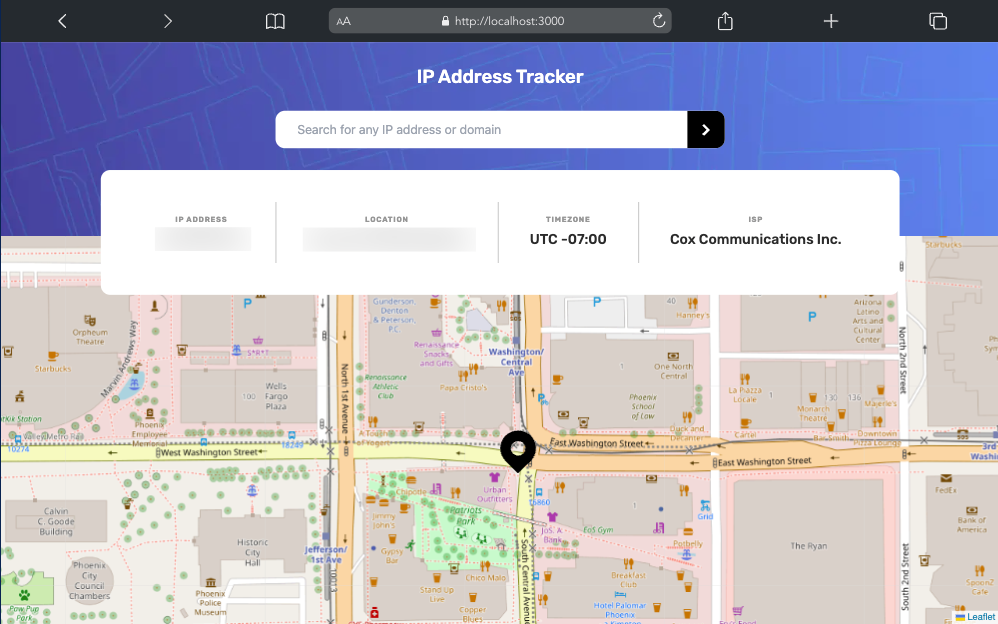

# Frontend Mentor - IP address tracker solution

This is a solution to the [IP address tracker challenge on Frontend Mentor](https://www.frontendmentor.io/challenges/ip-address-tracker-I8-0yYAH0). Frontend Mentor challenges help you improve your coding skills by building realistic projects.

## Table of contents

-   [Overview](#overview)
    -   [The challenge](#the-challenge)
    -   [Screenshot](#screenshot)
    -   [Links](#links)
-   [My process](#my-process)
    -   [Built with](#built-with)
    -   [What I learned](#what-i-learned)
    -   [Continued development](#continued-development)
-   [Author](#author)

**Note: Delete this note and update the table of contents based on what sections you keep.**

## Overview

### The challenge

Users should be able to:

-   View the optimal layout for each page depending on their device's screen size
-   See hover states for all interactive elements on the page
-   See their own IP address on the map on the initial page load
-   Search for any IP addresses or domains and see the key information and location

### Screenshot

### Links

-   Solution URL: [Add solution URL here](https://your-solution-url.com)
-   Live Site URL: [Add live site URL here](https://your-live-site-url.com)

## My process

### Built with

-   Semantic HTML5 markup
-   Flexbox
-   Mobile-first workflow
-   Next API Routes
-   [IP Geolocation API](https://geo.ipify.org/)
-   [React Leaflet](https://react-leaflet.js.org/) - React components for Leaflet maps
-   [Vercel](https://vercel.com/) - Website Deployment
-   [TailwindCSS](https://tailwindcss.com/) - CSS framework
-   [React](https://reactjs.org/) - JS library
-   [Next.js](https://nextjs.org/) - React framework

### What I learned

I pretty much used this project to get myself extremely familiar with Next.js and everything there is to know about it. I believe it's honestly one of the best frontend frameworks and the fact that it can be used in place of Express.js to create a backend API is a great plus. Some things I learned include realizing the fact that Next.js is equipped with so many great tools that ended up filling the void caused by code not working.

For example, Leaflet's package could not be imported into page component file due to the fact that it could not work with server-side rendering. The only workaround for this was to use `next/dynamic` which allows for dynamic importing of components for lazy loading. However, when implementing `Leaflet` and `React-Leaflet` into my main page, none of the components would work due to server side rendering so they had to be completely implemented into a separate React component folder which would use a `index.ts` file to export the main code of the component with the help of a dynamic import.

I also learned how to properly implement client-side data fetching in Next.js which can be done with either a `useEffect` hook or a helper function that would be called on a form submission or button click.

Lastly, there was a problem with the client-side data fetching where it wouldn't allow the client to run the request in the browser for security reasons. I ended up having to implement the data fetching in an Next.js API route that would handle the geolocation API request and return the response to the main page.

### Continued development

I definitely need to continue working on my Next.js skills because it's at times confusing to consider which type data fetching would be necessary for the required data. I would like to implement my own API based on a chosen database such as Supabase or PlanetScale in the future to really solidify these skills.

## Author

-   Frontend Mentor - [@oudajosefu](https://www.frontendmentor.io/profile/oudajosefu)
-   Twitter - [@oudajosefu](https://www.twitter.com/oudajosefu)
